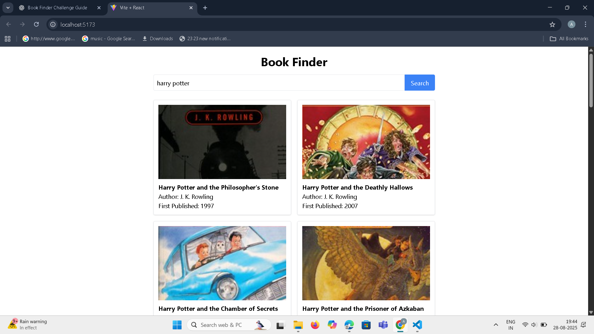

# 📚 Book Finder

A simple React + Vite + Tailwind app to search books by title using the [Open Library API](https://openlibrary.org/developers/api).
You can enter a book title, and it will fetch matching books with author names and cover images.

---

## 🚀 Live Demo
👉 [Book Finder App](https://book-finder-three-sigma.vercel.app)

---

## 🚀 Features
- Search books by **title**.
- Displays **cover, title, and author(s)**.
- Responsive grid layout.
- Loading indicator & error handling.
- Built with **React, Vite, and Tailwind CSS**.

---
## 🛠️ Tech Stack
- **React** (with Vite)
- **Tailwind CSS**
- **Open Library API**
- **Vercel** (for deployment)

---
## 📸 Screenshots

### Home Page


### Search Results


---

## 🛠️ Setup Instructions
1. Clone the repo:
   ```bash
   git clone <https://github.com/AnnaMariyaJohnson/book-finder.git>
   cd book-finder

2.Install dependencies:

npm install


3.Run the development server:

npm run dev


4.Build for production:

npm run build


5.Preview production build:

npm run preview
